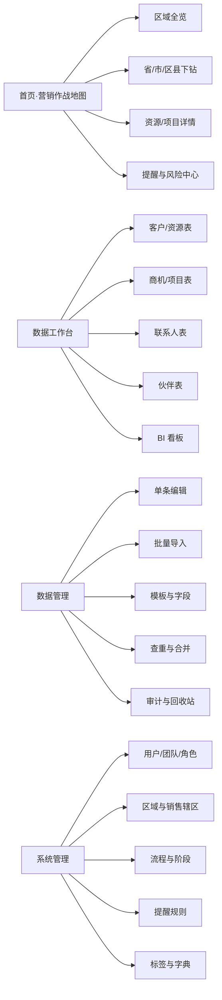
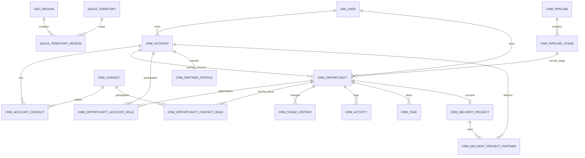

# 营销作战地图产品设计方案

版本：V1.0
日期：2026-06-29
适用范围：西南、华东区域起步，数据沉淀至区县级，架构支持后续扩展至全国

## 1. 方案结论

本产品不应被设计成“地图上放几个项目点”，而应被设计成一套以区县为空间索引、以客户与商机为业务主线、以销售动作和风险提醒为驱动的营销作战系统。

产品由六个能力域构成：

1. 地图作战：首页全览、省市区县下钻、资源/项目下钻、区域经营态势、风险与待办。
2. 数据工作台：类似多维表格的筛选、分组、排序、关联、保存视图和轻量 BI。
3. 数据管理：新建、修改、批量导入、模板下载、校验、查重、纠错和审计。
4. CRM 主线：客户、联系人、商机、销售阶段、跟进活动、任务、产品方案、输赢单。
5. CDP 增强：统一客户画像、身份归并、标签、动态分群、数据来源和画像完整度。
6. 权限与治理：角色权限、行级数据范围、字段权限、操作审计和导出管控。

### 1.1 必须纠正的分类问题

需求中实际包含五类地图对象，但它们并非同一业务维度：

| 地图展示类型 | 后台真实实体 | 说明 |
|---|---|---|
| 政府资源/项目 | 政府类客户 + 关联商机 | 资源可以先建档，后续产生一个或多个项目 |
| 产业资源/项目 | 产业类客户 + 关联商机 | 同一企业可有多个联系人和多个商机 |
| 平台型资源/项目 | 平台运营主体 + 关联商机 | 需区分平台主体、业主、运营方、建设方 |
| 单体项目 | 商机/项目 | 是项目形态，不是客户类型 |
| 合作伙伴 | 伙伴类客户 + 伙伴能力画像 | 重点记录实施区域、交付能力和合作项目 |

前端保留五个清晰图层；数据库拆分为“客户/资源、联系人、商机/项目、伙伴能力”四类核心实体。这样既满足地图认知，也避免把客户类型和项目类型塞进同一个字段后导致统计冲突。

## 2. 产品定位与目标

### 2.1 产品定位

面向销售、售前和经营管理人员的 B2B 区域营销作战平台，用一张地图回答五个核心问题：

- 哪些区县已有资源、客户、项目和伙伴覆盖？
- 每个项目推进到什么阶段，下一步动作是什么？
- 哪些项目即将到期、长期停滞或存在重大风险？
- 某个销售、区域、客户类型的项目数量、金额和转化情况如何？
- 客户、联系人、商机、活动和伙伴关系能否形成统一画像？

### 2.2 生产级 V1.0 成功标准

- 项目和资源能够准确归属到省、市、区县三级行政区域。
- 地图、表格、图表和导出使用完全相同的数据权限与筛选口径。
- 销售只能看到自己负责或明确协作的记录；售前和管理员可查看全部记录。
- 每个进行中商机必须有负责人、当前阶段、下一步动作和计划日期。
- 支持模板导入、错误预检、重复识别、错误行回传和导入审计。
- 从地图任一区县可在三次交互内进入具体客户或项目详情。

### 2.3 产品边界（不在本系统内重复建设）

- 财务回款、发票和完整合同管理。
- 复杂项目实施排期和工时管理。
- 自动化营销触达、短信、邮件投放。
- 黑盒式 AI 赢率预测。

这些能力通过标准接口与现有专业系统衔接，不降低生产级 V1.0 的完整性。

## 3. 用户角色与权限

### 3.1 建议角色

| 角色 | 默认数据范围 | 主要操作权限 |
|---|---|---|
| 销售 | 本人负责 + 明确协作 | 新建和维护客户、联系人、商机、活动、任务；不可物理删除 |
| 售前 | 全部数据 | 查看全部；补充方案、技术判断、风险和售前活动；不可擅自修改负责人和成交金额 |
| 管理员 | 全部数据 | 全量增删改查、导入、字段配置、阶段配置、权限、审计和数据归并 |
| 销售经理（建议预留） | 本团队 | 团队经营分析、项目复核、转移负责人、查看团队预测 |
| 数据运营（建议预留） | 全部或指定区域 | 模板、导入、查重、主数据修正；不改变业务阶段 |

### 3.2 权限设计原则

权限由三个部分相乘决定：

`功能权限 × 数据范围 × 字段权限`

- 功能权限：能否访问地图、客户、商机、导入、导出、系统配置等模块。
- 数据范围：全部、团队、本人、协作记录、自定义区域。
- 字段权限：查看、编辑、脱敏、不可见，例如联系人手机号、项目金额、输单原因。

所有地图聚合、BI 指标和导出必须在行级权限过滤之后计算，不能只在前端隐藏点位，否则销售仍可能从区县汇总数字推断他人项目。

CRM 产品普遍采用“全部/团队/本人”的记录访问范围，并可按销售阶段限制编辑；这与本系统的销售隔离、售前全局查看和管理员配置要求一致。[HubSpot 记录访问权限](https://knowledge.hubspot.com/records/assign-access-to-records)

## 4. 总体信息架构

主导航建议为：`作战地图 / 数据工作台 / BI 分析 / 数据管理 / 提醒中心 / 系统管理`。

## 5. 核心功能设计

### 5.1 首页：营销作战地图

#### 5.1.1 页面结构

1. 顶部全局筛选：区域、时间、销售、五类图层、商机阶段、健康度、金额范围、来源。
2. 左侧作战指标：有效资源数、进行中商机数、商机金额、加权金额、红色风险数、本周待办。
3. 中央地图：行政区填色、项目聚合点、图层切换、缩放和下钻。
4. 右侧提醒栏：逾期任务、阶段停滞、招投标临期、预计成交临期、数据缺失。
5. 底部趋势：新增商机、阶段转化、区域排名、销售排名，可折叠。

#### 5.1.2 地图交互

- 全览层：西南、华东的省级经营热度和五类资源分布。
- 区域层：点击省进入地市，点击地市进入区县；面包屑支持逐级返回。
- 区县层：展示该区县的客户、商机和伙伴聚合点，支持列表联动。
- 对象层：点击点位打开详情抽屉；多个对象同坐标时先展开聚合列表。
- 项目层：进入详情页查看阶段时间线、联系人、跟进活动、任务、伙伴和附件。
- 反向联动：地图框选或点击区县后，数据表和 BI 自动追加相同筛选；从表格也可“在地图中定位”。

#### 5.1.3 视觉编码

- 图标形状：区分政府、产业、平台、单体项目、合作伙伴。
- 颜色：只表达健康状态，绿色正常、黄色关注、红色风险、灰色暂停/关闭。
- 点大小：默认表达商机金额或资源优先级，可由用户切换。
- 商机阶段：通过筛选、标签和详情时间线表达，不再额外占用颜色，避免地图信息过载。

#### 5.1.4 区域指标

点击任一区县，展示：

- 五类对象数量及占比。
- 进行中商机数、商机金额、加权金额。
- 当前阶段分布和未来 30/60/90 天预计成交金额。
- 红黄风险项目数、逾期任务数、长期未跟进数。
- 销售覆盖和客户覆盖。
- 重点客户、重点项目、重点伙伴 Top N。

### 5.2 数据工作台：多维表体验

#### 5.2.1 基础视图

- 表格视图：批量编辑、冻结列、列宽、排序、筛选、分组、汇总。
- 看板视图：按商机阶段、健康度、负责人拖拽查看；阶段变更需通过校验。
- 地图视图：将当前筛选结果展示在地图上。
- 日历视图：按下一步动作、招标截止日、预计成交日查看。
- 保存视图：个人、团队、公开三种范围，可设置默认视图。

#### 5.2.2 筛选和定位

支持“且/或”组合条件，常用维度包括：

- 区域：大区、省、市、区县。
- 对象：客户类型、项目类型、伙伴类型、标签、来源。
- 过程：销售阶段、健康度、优先级、负责人、售前、最后跟进日期。
- 结果：金额、概率、预计成交时间、赢单/输单。
- 数据质量：缺负责人、缺区县、缺联系人、疑似重复、画像完整度。

#### 5.2.3 轻量 BI

生产级 V1.0 支持指标卡、柱状图、折线图、饼图、漏斗图、区域排名和明细下钻。图表必须继承当前用户的数据权限，并支持点击图表反向筛选明细。飞书多维表格也将记录、字段、视图、仪表盘和高级权限作为独立资源，且仪表盘可按访问者的数据权限统计，这一机制适合作为本系统表格与 BI 一体化的参考。[飞书多维表格开放平台](https://open.feishu.cn/document/server-docs/docs/bitable-v1/bitable-overview?lang=zh-CN) [飞书多维表格仪表盘](https://www.feishu.cn/hc/zh-CN/articles/161059314076-%E4%BD%BF%E7%94%A8%E5%A4%9A%E7%BB%B4%E8%A1%A8%E6%A0%BC%E4%BB%AA%E8%A1%A8%E7%9B%98)

### 5.3 数据管理

#### 5.3.1 单条维护

- 新建客户/资源时，可先保存最小档案：名称、类型、区县、负责人、来源。
- 创建商机时，必须关联主客户；可以关联多个政府部门、平台方和合作伙伴。
- 联系人采用独立实体，可同时关联多个组织并记录不同角色。
- 赢单后可一键转为交付项目，保留全部阶段历史和活动。

#### 5.3.2 批量导入

导入流程必须是：

`下载模板 → 上传文件 → 字段映射 → 预校验 → 重复识别 → 确认导入 → 结果报告`

预校验至少覆盖：

- 必填字段、字段类型、枚举值、日期、金额。
- 省市区县的行政区划编码与名称一致性。
- 客户负责人、售前和伙伴是否为有效用户/组织。
- 统一社会信用代码、标准化名称、手机号和邮箱的重复识别。
- 外部系统 ID 的幂等检查，防止重复导入。

导入结果应给出成功数、失败数、新增数、更新数、疑似重复数，并允许下载错误行和原因。

#### 5.3.3 数据治理

- 软删除和回收站，核心记录禁止直接物理删除。
- 客户合并保留主记录、来源记录和字段取值依据。
- 记录每次字段变更的用户、时间、旧值、新值和来源。
- 联系方式等敏感字段按角色脱敏，导出单独授权。
- 每条记录保留数据来源、外部 ID、导入批次和最近同步时间。

### 5.4 CRM 能力补全

#### 5.4.1 客户与联系人

- 客户主档：客户类型、行业、级别、区域、标签、价值评分、负责人、生命周期。
- 联系人：部门、职务、联系方式、决策角色、关系强度、影响力和最近互动。
- 客户关系图谱：客户—联系人—商机—合作伙伴—交付项目。
- 关键人角色：决策人、技术决策人、业务负责人、采购、财务、影响者、使用方。

#### 5.4.2 商机和销售流程

商机流程必须可配置，生产级 V1.0 提供以下默认模板：

| 阶段 | 默认概率 | 建议必填项 | 退出条件 |
|---|---:|---|---|
| 线索 | 5% | 来源、区域、负责人 | 已确认真实主体 |
| 商机 | 20% | 联系人、需求摘要、预算线索 | 已形成有效商机 |
| 方案设计 | 50% | 方案、售前、竞争态势 | 客户认可方案方向 |
| 招投标 | 80% | 招采方式、报价、投标时间、竞争对手 | 已完成招投标流程 |
| 合同签订 | 90% | 合同金额、预计签约日 | 合同完成审批并待签署 |
| 赢单 | 100% | 实际金额、签约日 | 转交付项目 |

CRM 的阶段模型应支持“不同流程使用不同管道、相同流程共用管道并通过权限隔离”；阶段应带默认概率，从而计算加权商机金额。[HubSpot 管道与阶段](https://knowledge.hubspot.com/object-settings/set-up-and-customize-pipelines)

#### 5.4.3 活动、任务和协作

- 活动：拜访、电话、会议、方案交流、投标、邮件、纪要、其他。
- 任务：待办、截止时间、提醒时间、优先级、负责人、完成状态。
- 记录协作者：销售主责、协同销售、售前、管理人员。
- 阶段变更必须生成历史；关键阶段变更可要求填写说明。
- 详情页采用时间线整合活动、任务、阶段、附件和风险。

### 5.5 CDP 思路的适度引入

本系统面向 B2B 项目经营，不需要复制消费型 CDP，但应引入以下数据能力：

1. 统一客户画像：合并 CRM、Excel、历史项目和外部系统中的同一客户。
2. 身份映射：用统一社会信用代码、外部系统 ID、标准化名称和人工确认建立主记录。
3. 客户—人员关系：允许一个联系人关联多个组织，也允许一个组织关联多个关键人。
4. 标签与动态分群：例如“华东区政府客户”“90 天无跟进的 A 类客户”“未来 60 天拟投标项目”。
5. 画像完整度：对区域、关键人、行业、项目阶段、下一步动作等字段进行质量评分。
6. 互动与热度：将拜访、会议、方案交流等活动汇总为可解释的参与度分数。
7. 数据来源与血缘：展示画像字段来自手工录入、导入文件还是外部系统。

Adobe 的 B2B CDP 将多来源账户信息统一为账户画像，并关联商机和联系人；账户级分群再结合人员关系和互动信号，这一思路适合本系统的“客户统一画像 + 区域/客户分群”。[Adobe B2B 账户画像](https://experienceleague.adobe.com/en/docs/experience-platform/rtcdp/account/account-profile-overview) [Adobe B2B 账户分群](https://experienceleague.adobe.com/en/docs/experience-platform/segmentation/types/account-audiences)

## 6. 提醒和风险规则

### 6.1 风险等级

| 等级 | 含义 | 示例 |
|---|---|---|
| 红色 | 已经违约或高概率影响成交 | 任务逾期、招标截止不足 3 天、预计成交日已过、关键阶段资料缺失 |
| 黄色 | 需要关注 | 超过阶段 SLA、连续多日无跟进、没有下一步动作、金额或概率异常 |
| 绿色 | 正常推进 | 近期有有效活动、下一步动作明确、关键资料完整 |
| 灰色 | 暂停或关闭 | 搁置、输单、取消、已归档 |

### 6.2 默认提醒

- 下一步动作在 24 小时内到期。
- 任务已逾期。
- 商机在当前阶段停留超过阶段 SLA。
- 商机连续 N 天没有有效跟进，N 按阶段和项目级别配置。
- 招标、投标、评审、预计签约日期临近。
- 预计成交日已过但商机未关闭。
- 进入关键阶段但缺少必填材料或关键联系人。
- 客户或商机没有负责人、区县或有效坐标。
- 同一客户存在多个负责人或疑似重复记录。
- 合作伙伴交付能力、覆盖区域或可用容量不满足项目要求。

提醒规则必须配置化，不能把天数和阈值写死在业务代码中。

## 7. BI 指标体系

### 7.1 核心指标

- 资源总数、有效客户数、新增客户数。
- 进行中商机数、商机金额、加权商机金额。
- 赢单金额、赢单率、输单率、平均销售周期。
- 阶段转化率、阶段平均停留时长、停滞商机率。
- 未来 30/60/90 天预计成交金额。
- 区县覆盖数、重点区县覆盖率、空白区县数。
- 客户画像完整度、有效联系人覆盖率、关键决策人覆盖率。
- 伙伴数量、已认证伙伴数、伙伴参与项目数、交付容量风险数。

### 7.2 分析维度

时间、区域、销售辖区、负责人、售前、客户类型、项目类型、行业、阶段、健康度、来源、优先级、金额区间、标签、合作伙伴。

### 7.3 口径约束

- “商机金额”只统计未删除且状态为进行中的商机。
- “加权金额”=`商机金额 × 当前概率`。
- “赢单率”同时提供按项目数和按金额两种口径。
- “停滞”按当前阶段 SLA 判断，不使用一个全局天数。
- BI 使用每日快照保存历史，不能用当前表反推过去状态。

## 8. 数据模型

### 8.1 核心实体关系

### 8.2 行政区域与销售辖区

| 表 | 关键字段 | 用途 |
|---|---|---|
| `geo_region` | `admin_code, name, level, parent_id, geom, centroid, valid_from, valid_to` | 省、市、区县标准主数据和地图边界 |
| `sales_territory` | `name, parent_id, owner_user_id, status` | 自定义西南、华东及团队辖区 |
| `sales_territory_region` | `territory_id, region_id` | 销售辖区与行政区域多对多映射 |

行政区划代码不能只存中文名称；应保留代码、父级和有效期，以处理同名区县及后续行政区调整。直辖市按“省级直辖市—地市占位层—区县”统一 API 层级，保证上海市徐汇区和成都市金牛区使用同一套下钻逻辑。

销售辖区与行政区划分开建模，原因是“华东/西南”的业务边界可能按公司经营范围调整，不应写死为地图行政区。Salesforce 的销售辖区模型也将辖区层级、账户/线索/用户分配、商机分配和辖区预测分开管理，可作为参考。[Salesforce 销售辖区实施指南](https://resources.docs.salesforce.com/latest/latest/en-us/sfdc/pdf/salesforce_implementing_territory_mgmt2_guide.pdf)

### 8.3 客户、联系人与商机

| 表 | 关键字段 | 用途 |
|---|---|---|
| `crm_account` | `account_name, account_category, region_id, owner_user_id, lifecycle_status, grade, engagement_score` | 政府、产业、平台、伙伴等组织主档 |
| `crm_contact` | `contact_name, mobile, email, status` | 联系人主档 |
| `crm_account_contact` | `account_id, contact_id, department, title, decision_role, relation_strength` | 组织与人员的多对多关系 |
| `crm_pipeline` | `name, applies_to, status` | 不同销售流程的管道定义 |
| `crm_pipeline_stage` | `pipeline_id, name, stage_group, probability, sla_days, required_fields` | 阶段、概率、SLA 和必填规则 |
| `crm_opportunity` | `name, primary_account_id, opportunity_type, stage_id, amount, probability, expected_close_date, health_status` | 商机/项目推进主记录 |
| `crm_opportunity_account_role` | `opportunity_id, account_id, role_type` | 业主、预算方、运营方、总集、伙伴、竞争方 |
| `crm_opportunity_contact_role` | `opportunity_id, contact_id, role_type, influence_level` | 项目决策链/购买委员会 |
| `crm_stage_history` | `opportunity_id, from_stage_id, to_stage_id, changed_at, changed_by` | 阶段历史和漏斗计算 |
| `crm_activity` | `activity_type, account_id, opportunity_id, occurred_at, content, created_by` | 拜访、会议、方案交流等事实记录 |
| `crm_task` | `task_type, opportunity_id, assignee_user_id, due_at, reminder_at, status` | 下一步动作和待办 |

### 8.4 伙伴与交付

| 表 | 关键字段 | 用途 |
|---|---|---|
| `crm_partner_profile` | `account_id, partner_level, certification_status, delivery_rating, available_capacity` | 伙伴扩展画像 |
| `crm_partner_capability` | `partner_account_id, capability_code, capability_name, region_id, grade` | 实施范围、产品能力和区域覆盖 |
| `crm_delivery_project` | `opportunity_id, project_status, start_date, end_date, contract_amount` | 赢单后的交付项目 |
| `crm_delivery_project_partner` | `project_id, partner_account_id, role_type, work_scope, status` | 项目与交付伙伴的多对多关系 |

### 8.5 标签、视图与数据治理

| 表 | 关键字段 | 用途 |
|---|---|---|
| `crm_tag` / `crm_entity_tag` | `tag_name, entity_type, entity_id` | 可复用标签 |
| `crm_segment` / `crm_segment_member` | `entity_type, rule_json, entity_id` | 静态或动态分群 |
| `meta_custom_field_definition` | `entity_type, field_key, field_type, option_json` | 自定义扩展字段定义 |
| `meta_saved_view` | `entity_type, scope_type, config_json` | 多维表保存视图 |
| `meta_alert_rule` / `crm_alert_event` | `rule_type, condition_json, severity, status` | 规则配置和告警实例 |
| `ops_data_source` / `ops_external_identity` | `source_code, entity_type, external_id` | 数据来源和外部身份映射 |
| `ops_import_job` / `ops_import_error` | `file_name, status, row_no, error_code` | 导入任务及错误明细 |
| `ops_audit_log` | `entity_type, entity_id, action, old_data, new_data, operator_id` | 操作审计 |
| `bi_opportunity_daily_snapshot` | `snapshot_date, opportunity_id, stage_id, amount, health_status` | 历史漏斗和趋势分析 |

核心字段使用关系型列，低频差异字段放入 `custom_fields JSONB` 并由字段定义表管理。不要把全部业务字段做成 EAV，也不要只用一个大 JSON 保存所有数据，否则筛选、索引、权限和 BI 都会迅速失控。

### 8.6 五类地图图层的计算规则

| 条件 | 地图图层 |
|---|---|
| `account_category = GOVERNMENT` | 政府资源/项目 |
| `account_category = INDUSTRY` | 产业资源/项目 |
| `account_category = PLATFORM` | 平台型资源/项目 |
| `opportunity_type = STANDALONE` | 单体项目，优先级高于主客户类型 |
| `account_category = PARTNER` | 合作伙伴 |

客户资源和商机项目可以同时出现在地图中，但必须带 `object_kind=RESOURCE/OPPORTUNITY/PARTNER`，防止指标汇总时把客户数和项目数混为一谈。

## 9. 关键接口建议

| 接口 | 用途 |
|---|---|
| `GET /api/map/regions` | 按当前层级返回区域聚合指标和风险 |
| `GET /api/map/objects` | 按视口、缩放级别和筛选条件返回聚合点/对象点 |
| `GET /api/regions/{id}/summary` | 区县作战摘要 |
| `GET /api/accounts/{id}/profile` | 统一客户画像及关联联系人、商机、活动 |
| `GET /api/opportunities/{id}` | 商机详情、阶段、角色、任务、风险 |
| `POST /api/opportunities/{id}/stage-transitions` | 阶段变更并执行必填/SLA 校验 |
| `POST /api/imports/preview` | 上传并预检导入文件 |
| `POST /api/imports/{id}/commit` | 确认导入 |
| `GET /api/views/{id}/data` | 按保存视图返回表格或 BI 数据 |

地图接口必须按视口和缩放层级查询；行政区边界建议使用矢量切片，不能在首页一次性加载所有区县边界和全部项目点。

## 10. 技术架构建议

### 10.1 推荐技术组合

- 前端：React 或 Vue + 企业级组件库 + 地图可视化组件。
- 地图：采用具备国内合规底图和区县边界能力的地图服务；业务库统一存储标准坐标并在服务层适配地图供应商坐标系。
- 后端：Java/Spring Boot、Node.js/NestJS 或团队已有主栈，优先保持组织技术一致性。
- 主数据库：PostgreSQL + PostGIS，承担主数据、空间查询、权限过滤和轻量聚合。
- 缓存与异步：Redis + 消息队列，用于热点地图聚合、导入任务和提醒计算。
- 文件：对象存储，用于导入文件、附件和错误报告。
- 分析：生产级 V1.0 使用 PostgreSQL 快照和物化视图；数据规模和并发上升后再引入 ClickHouse 等分析引擎。

### 10.2 关键设计约束

- 地图、表格、BI 共用一个筛选 DSL 和权限服务。
- 业务主键使用 UUID，行政区使用标准代码作为稳定业务键。
- 记录使用软删除、乐观锁和完整审计。
- 导入采用异步任务；同一来源外部 ID 保证幂等。
- 高频筛选字段建立组合索引；空间字段建立 GiST 索引。
- 每日生成商机快照，保留历史口径。

## 11. 生产级 V1.0 完整范围

正式上线前一次性交付以下能力，不向领导发布功能残缺的中间版本：

- 区域主数据、销售辖区、五类地图图层和省市区县下钻。
- 客户、联系人、商机、伙伴、活动、任务、交付项目和完整阶段历史。
- 配置化管道、阶段门禁、提醒规则、标签、分群和画像完整度。
- 表格、看板、地图、日历、保存视图、自定义字段和批量操作。
- 领导驾驶舱、漏斗、区域分析、每日快照、预测看板和会议模式。
- 模板导入、预校验、查重、合并、错误报告、审计、回收站和数据血缘。
- 销售本人、销售团队、售前全部、管理员全部和字段级权限。
- 伙伴能力、区域覆盖、伙伴匹配和赢单转交付。
- SSO、通知、监控、备份恢复、性能、安全和生产运维体系。

AI 风险摘要、智能推荐和原生移动 App 属于后续增强，不作为基础系统上线的依赖。

具体团队、架构、排期和上线门禁见 `营销作战地图_生产级开发实施方案.md`。

## 12. 生产级 V1.0 验收清单

- [ ] 成都市金牛区、上海市徐汇区等区县能被准确检索、定位和聚合。
- [ ] 省—市—区县—对象—项目详情下钻完整可用。
- [ ] 五类地图图层可独立开关，且资源数和项目数口径不混淆。
- [ ] 地图筛选与表格、BI、导出结果一致。
- [ ] 销售无法通过任何接口、汇总或导出看到非本人数据。
- [ ] 售前可查看全部项目并记录售前活动和风险。
- [ ] 商机阶段、概率、金额、下一步动作和阶段历史完整。
- [ ] 逾期、停滞、临期和资料缺失能生成提醒并闭环处理。
- [ ] 模板导入支持预检、查重、错误下载、幂等和审计。
- [ ] 赢单商机可转成交付项目并关联实施伙伴。

## 13. 配套数据库脚本

与本方案配套的 PostgreSQL/PostGIS 初始结构见：`营销作战地图_数据库结构.sql`。脚本覆盖行政区域、销售辖区、用户权限、客户、联系人、商机、活动任务、伙伴、交付、标签分群、导入审计、告警和 BI 快照。
