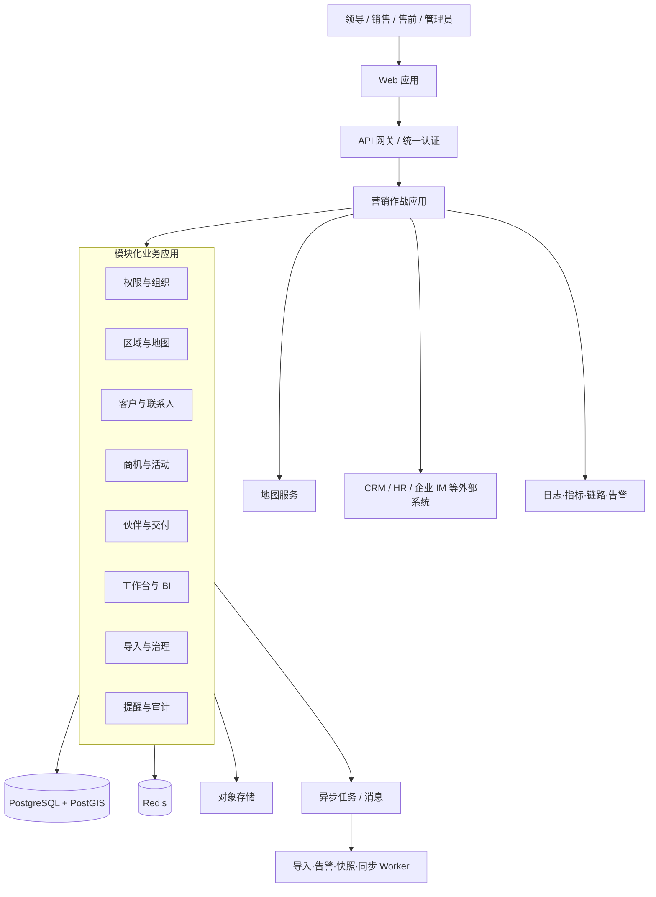

# 营销作战地图生产级开发实施方案

版本：V1.0
日期：2026-06-29
目标：首个正式发布版本即达到“领导可看、业务可用、数据可信、权限安全、运维可控”的生产标准

## 1. 结论

这个项目可以不发布 MVP，但不能取消内部工程阶段。

正确做法是：

- 不把功能残缺的试验版本推给领导和业务使用。
- 内部仍按“方案冻结—设计完成—功能完成—集成完成—真实数据演练—UAT—上线”逐级过门。
- 正式上线的 V1.0 一次性交付完整业务闭环、领导驾驶舱、真实数据、权限、审计、监控和运维能力。

按 12—13 人全职交付团队估算，建议用 18 周完成建设和正式上线，随后安排 2 周上线保障，总周期约 20 周。若团队只有 7—8 人，合理周期会接近 28—32 周。这里的阶段是内部开发与质量门禁，不是向用户发布的 MVP。

## 2. 什么叫“领导能直接使用的版本”

生产级 V1.0 必须同时满足五个条件：

1. 看得懂：打开首页 10 秒内知道整体经营态势、重点区域、重大项目和主要风险。
2. 点得透：从大区、省、市、区县可以下钻到客户、商机、联系人、跟进和风险详情。
3. 数据真：展示真实业务数据，指标口径统一，能够解释每个数字来自哪里。
4. 管得住：销售只能看自己的数据，售前和管理员按规则查看；导入、导出、修改全部有审计。
5. 跑得稳：有生产环境、备份恢复、监控告警、性能基线、故障预案和上线支持。

因此，生产级 V1.0 不是“更多页面”，而是“完整功能 + 可信数据 + 安全权限 + 稳定运行”。

## 3. 生产级 V1.0 的完整范围

### 3.1 领导驾驶舱

必须独立设计领导视角，不能把销售操作页面简单放大。

- 全国/西南/华东经营地图，默认展示区域热度、重点项目和重大风险。
- 六个核心指标：资源数、活跃商机数、商机金额、加权金额、未来 90 天预测、红色风险数。
- 区域经营排名、负责人排名、阶段漏斗和 30/60/90 天预测。
- 重点项目 Top N、长期停滞项目、招投标临期项目、无下一步动作项目。
- 数据更新时间、统计口径说明和异常数据提示。
- “会议模式”：16:9 全屏、固定筛选、数据快照、一键导出 PDF/图片。
- 领导批注/督办：对项目提出关注、指定责任人和截止日期，并进入任务闭环。

### 3.2 营销作战地图

- 大区、省、市、区县四级浏览，区县为业务沉淀最小空间单元。
- 政府、产业、平台、单体项目、合作伙伴五个业务图层。
- 区域填色、对象聚合、视口查询、地图框选、图层开关和地图/列表联动。
- 点击区域展示经营摘要；点击对象进入客户或项目详情。
- 地图筛选与表格、BI、导出使用同一筛选条件和权限口径。
- 地理编码纠错、区县归属校验、坐标异常检查和手工修正。

### 3.3 完整 CRM 闭环

- 客户/资源、联系人、商机、活动、任务、伙伴和交付项目。
- 客户统一画像、决策链、关联项目、历史互动、标签和画像完整度。
- 配置化销售管道、阶段概率、阶段 SLA、阶段门禁和必填规则。
- 下一步动作、拜访/会议/方案/投标记录、附件和项目时间线。
- 赢单、输单、搁置、复盘和赢单后转交付。
- 负责人、协作者、售前和伙伴的多人协作关系。

### 3.4 多维数据工作台

- 表格、看板、地图、日历和仪表盘视图。
- 组合筛选、排序、分组、聚合、冻结列、列配置和批量编辑。
- 个人、团队、公开保存视图及默认视图。
- 从图表下钻明细，从表格反向定位地图。
- 自定义字段、枚举、公式型计算字段和关联字段。
- 批量操作必须经过权限检查和二次确认。

### 3.5 数据分析

- 商机漏斗、阶段转化、阶段停留时长、赢单率和销售周期。
- 区域、销售、客户类型、项目类型、行业和来源分析。
- 未来 30/60/90 天预测、加权管道和目标差距。
- 客户画像完整度、联系人覆盖、空白区县和伙伴覆盖。
- 每日快照保存历史口径，支持“回看某日状态”。
- 指标字典、口径说明和数据负责人。

### 3.6 数据管理和治理

- 版本化模板下载、上传、字段映射、预校验、查重、确认导入和结果报告。
- 客户名称标准化、统一社会信用代码识别、联系人去重和外部 ID 幂等。
- 疑似重复记录人工合并，保留字段取值来源和合并历史。
- 数据来源、导入批次、同步时间、字段血缘和数据质量评分。
- 软删除、回收站、恢复、导出审批和完整审计。

### 3.7 用户、权限和系统配置

- 用户、团队、角色、菜单、操作、数据范围和字段权限。
- 销售本人、销售团队、售前全部、管理员全部、自定义辖区等数据范围。
- 联系方式和敏感金额的字段脱敏。
- 区域、辖区、字典、标签、管道、阶段、告警规则和模板配置。
- SSO 登录、组织/用户同步、离职禁用和负责人转移。

### 3.8 提醒和协同

- 任务到期、任务逾期、阶段停滞、长期无跟进、投标临期、成交日期已过和资料缺失。
- 站内消息，并预留企业微信、飞书或钉钉通知通道。
- 告警确认、指派、处理、忽略和关闭的完整状态。
- 每日个人待办、每周团队摘要和领导重点项目摘要。

## 4. 明确的产品边界

“不做 MVP”不能等于“把所有相邻系统一起做掉”。生产级 V1.0 建议不自建以下系统：

- 财务核算、开票和回款系统。
- 完整电子合同和法务审批系统。
- 复杂项目工时、成本和资源排期系统。
- 广告、短信、邮件自动化营销平台。
- 原生移动 App。
- 缺少历史数据支撑的 AI 赢率预测。

这些能力通过接口、链接或后续模块衔接。边界清晰是按期上线的重要前提，不是降低质量。

## 5. 第一个架构决策：谁是主数据系统

编码前必须确认当前是否已经存在 CRM。

### 模式 A：已有 CRM

- 现有 CRM 继续作为客户、联系人和商机的权威主数据源。
- 营销作战地图负责区域画像、地图分析、经营驾驶舱、提醒和伙伴能力。
- 双方通过稳定外部 ID 同步；禁止两边分别生成同一客户主键。
- 明确哪些字段单向同步、哪些字段允许回写、冲突以哪一方为准。

### 模式 B：没有 CRM 或准备替换

- 本系统直接作为客户、联系人、商机和销售活动的权威主数据系统。
- Excel、历史台账和外部来源全部通过导入/同步进入本系统。
- 后续合同、交付、财务系统只引用本系统业务主键。

这个决策应在第 1 周完成，否则数据模型、接口、权限和迁移方案都会反复返工。

## 6. 推荐技术架构

### 6.1 总体判断

推荐使用“模块化单体 + 独立异步任务进程”，不建议为了显得高级直接拆成大量微服务。

原因是本系统业务模块多，但交易规模通常不需要几十个独立服务。模块化单体可以保持一个事务边界和较低运维复杂度，同时通过明确模块 API、领域事件和依赖校验控制代码耦合。Spring Modulith 官方能力支持按业务功能组织模块、验证模块依赖和生成模块文档，适合作为 Java 团队的实现参考。[Spring Modulith](https://docs.spring.io/spring-modulith/reference/index.html)

### 6.2 推荐技术组合

| 层级 | 推荐方案 | 说明 |
|---|---|---|
| Web 前端 | React + TypeScript + 企业级组件库 | 领导驾驶舱、地图、工作台和管理端统一工程 |
| 地图可视化 | 国内合规底图 + 地图可视化引擎 | 支持行政区边界、聚合点、矢量切片和坐标适配 |
| 图表 | ECharts 或 AntV | 驾驶舱、漏斗、趋势和排名 |
| 后端 | Java + Spring Boot + 模块化架构 | 企业内部系统稳定、权限和事务能力成熟 |
| 主数据库 | PostgreSQL + PostGIS | 业务数据、区县空间查询、行级安全和快照 |
| 缓存 | Redis | 热点区域聚合、会话、分布式锁和短期缓存 |
| 异步任务 | 消息队列或数据库 Outbox + Worker | 导入、告警、快照、通知和同步任务 |
| 文件 | S3 兼容对象存储/MinIO | 模板、导入文件、附件和错误报告 |
| 搜索 | PostgreSQL 全文/模糊检索起步 | 数据量或检索复杂度达到阈值后再引入 OpenSearch |
| 身份 | OIDC/SAML/企业组织身份 | 接入现有统一认证和组织通讯录 |
| 数据库迁移 | Flyway 或 Liquibase | 所有结构变更版本化、可审计、可回滚 |
| 可观测性 | OpenTelemetry + 现有监控平台 | 统一日志、指标和调用链 |

PostGIS 提供 Geometry/Geography、空间关系和 GiST 空间索引，适合区县边界、点位归属和视口查询；空间查询必须使用能够命中索引的函数和操作符。[PostGIS 空间索引](https://postgis.net/documentation/faq/spatial-indexes/)

### 6.3 逻辑架构

### 6.4 后端模块边界

建议至少拆成以下代码模块，而不是按 Controller/Service/DAO 技术层横向堆放：

1. `identity`：用户、团队、角色、权限和 SSO。
2. `geography`：行政区、销售辖区、坐标、地理编码和空间查询。
3. `account`：客户、资源、联系人、统一画像和身份归并。
4. `opportunity`：商机、管道、阶段、活动、任务和输赢单。
5. `partner`：伙伴画像、能力、覆盖区域和交付关系。
6. `workbench`：保存视图、自定义字段、筛选 DSL 和批量操作。
7. `analytics`：快照、指标、驾驶舱和导出。
8. `alerting`：规则、告警事件、通知和督办。
9. `integration`：导入、同步、外部 ID、Outbox 和幂等。
10. `audit`：审计、回收站、合并和数据血缘。

模块之间只能调用公开接口或领域事件，并通过自动化架构测试防止循环依赖。

## 7. 数据权限必须双层实现

### 应用层

- 每个 API 先判断功能权限、数据范围和字段权限。
- 所有地图、列表、图表、导出使用同一个权限上下文。
- 批量接口逐条验证，不能因通过了菜单权限就直接批量修改。
- 对手机号、邮箱、项目金额等敏感字段做字段级脱敏。

### 数据库层

- 对客户、联系人、商机和 BI 快照启用 PostgreSQL Row-Level Security 作为第二道防线。
- 应用业务账号不能拥有 `BYPASSRLS`，也不能以表所有者身份运行查询。
- 管理脚本、数据迁移账号和线上应用账号完全分离。
- 自动化测试覆盖销售本人、协作者、团队、售前和管理员组合。

PostgreSQL 的行级安全策略可分别控制查询、插入、更新和删除；启用后没有匹配策略时默认拒绝访问，但表所有者和 `BYPASSRLS` 角色需要额外处理。[PostgreSQL Row-Level Security](https://www.postgresql.org/docs/current/ddl-rowsecurity.html)

## 8. 团队配置

### 8.1 推荐全职团队

| 角色 | 人数 | 核心责任 |
|---|---:|---|
| 业务产品负责人 | 1 | 业务口径、范围决策、验收和跨部门协调 |
| 产品经理/业务分析 | 1 | PRD、流程、字段、规则和验收场景 |
| UX/UI 设计师 | 1 | 驾驶舱、地图、工作台和设计系统 |
| 技术负责人/架构师 | 1 | 架构、领域边界、安全、质量和关键代码 |
| 前端工程师 | 2 | 地图、驾驶舱、表格和管理端 |
| 后端工程师 | 3 | CRM、权限、空间、导入、分析和集成 |
| 数据/BI 工程师 | 1 | 指标口径、快照、数据迁移和看板 |
| 测试工程师 | 2 | 功能、接口、自动化、权限、性能和 UAT 支持 |
| DevOps/安全 | 0.5—1 | 环境、流水线、监控、备份和安全检查 |
| GIS 支持 | 0.5 | 行政区数据、地图服务、坐标和空间性能 |

产品负责人必须来自实际业务，而不是由技术负责人代替。销售、售前、管理层各指定 1—2 名业务代表参与每周评审和 UAT。

### 8.2 不建议的配置

- 只有前后端开发，没有专职产品和测试。
- 设计师只在最后“美化首页”。
- 数据迁移在上线前一周才开始。
- 权限由前端菜单控制，测试只用管理员账号。
- 领导驾驶舱由开发人员根据已有字段临时拼图。

## 9. 20 周交付计划

下面的工作流可以并行，但每个质量门必须通过后才能进入下一状态。

| 周期 | 工作流 | 关键产出 | 通过门槛 |
|---|---|---|---|
| 第 1—2 周 | 业务和数据定版 | 生产级 PRD、角色矩阵、指标字典、主数据归属、范围清单 | 业务负责人书面确认 |
| 第 1—3 周 | UX/UI 和交互设计 | 全量页面结构、高保真设计、状态和异常场景、设计系统 | 领导首页和核心流程评审通过 |
| 第 2—5 周 | 工程底座 | 仓库、模块骨架、SSO、权限框架、数据库迁移、CI/CD、环境 | 能部署到测试环境，权限样例跑通 |
| 第 4—10 周 | CRM 和业务闭环 | 客户、联系人、商机、活动、任务、伙伴、交付、配置 | 三条端到端业务链路通过 |
| 第 5—12 周 | 地图和数据工作台 | 区域下钻、五类图层、表格/看板/日历/保存视图 | 地图、表格和权限口径一致 |
| 第 7—13 周 | 驾驶舱和 BI | 指标、快照、漏斗、排名、预测、会议模式 | 指标逐项可追溯到明细 |
| 第 8—13 周 | 数据治理和提醒 | 导入、查重、合并、审计、规则、通知 | 真实样本文件全流程通过 |
| 第 12—16 周 | 全量集成和硬化 | E2E、性能、安全、备份恢复、故障演练 | 无阻断缺陷，SLO 达标 |
| 第 14—17 周 | 数据迁移和 UAT | 两轮迁移演练、对账、角色 UAT、操作手册 | 业务负责人和数据负责人签字 |
| 第 18 周 | 正式上线 | 生产发布、最终迁移、监控、培训、回滚包 | 上线委员会放行 |
| 第 19—20 周 | 上线保障 | 问题响应、性能观察、数据纠错、使用支持 | 连续稳定运行并完成移交 |

### 9.1 必须跑通的三条端到端链路

1. 客户建档 → 联系人 → 商机 → 阶段推进 → 跟进活动 → 风险提醒 → 领导驾驶舱。
2. 模板上传 → 预检 → 查重 → 导入 → 权限过滤 → 地图展示 → BI 汇总 → 导出审计。
3. 商机赢单 → 交付项目 → 匹配实施伙伴 → 伙伴任务 → 项目风险 → 领导督办。

开发迭代应围绕这些完整链路组织，不能按“前端先把所有页面画完、后端再补接口”的方式串行开发。

## 10. 环境和发布体系

至少建设四套环境：

- 开发环境：开发自测和模块联调。
- 测试环境：持续集成、接口、E2E 和权限自动化。
- 预生产环境：与生产拓扑一致，用于性能、安全、迁移和发布演练。
- 生产环境：真实用户和真实数据。

发布要求：

- 主干保护、代码评审、静态检查、依赖漏洞检查和自动化测试。
- 数据库变更全部脚本化，禁止生产环境手工改表。
- 发布包不可变，同一构建产物从测试逐级晋升到生产。
- 支持滚动或蓝绿发布；数据库变更保持向前/向后兼容。
- 每次发布有变更清单、验证清单、回滚步骤和负责人。
- 若公司已有稳定容器平台则使用；不要为了单一项目临时自建 Kubernetes。Kubernetes 官方也明确生产集群需要额外规划高可用、访问控制、证书、备份和持续运维。[Kubernetes 生产环境](https://kubernetes.io/docs/setup/production-environment/)

## 11. 测试和质量门禁

### 11.1 测试层次

- 单元测试：阶段规则、金额、权限、告警和数据校验。
- 模块测试：模块边界、数据库、事件和事务。
- API 合约测试：前后端和外部系统接口。
- 端到端测试：三条核心业务链路。
- 权限矩阵测试：销售、协作者、经理、售前、数据运营和管理员。
- 数据测试：导入、去重、合并、快照、指标和历史迁移。
- 性能测试：地图、筛选、表格、导入、导出和驾驶舱。
- 安全测试：认证、越权、注入、上传、导出、敏感数据和审计。
- 恢复测试：备份恢复、应用回滚、数据库迁移回滚和外部服务降级。

### 11.2 上线阻断条件

以下任一项不满足，不允许上线：

- 存在 P0/P1 缺陷或已知权限泄露。
- 任一核心指标无法下钻到明细或与对账数据不一致。
- 销售账号可以通过地图、BI、导出或 API 看到他人数据。
- 备份未实际恢复验证。
- 没有生产监控、错误告警或应急联系人。
- 真实数据迁移没有完成至少两轮演练。
- 领导首页未使用真实数据进行验收。

安全验收建议以 OWASP ASVS Level 2 为基线，并根据内部敏感数据要求提高部分控制等级；ASVS 用于把架构、认证、访问控制、输入校验等安全要求转化为可测试的检查项。[OWASP ASVS](https://devguide.owasp.org/en/06-verification/01-guides/03-asvs/)

## 12. 建议的容量和服务目标

在没有现成用户量数据时，可先按以下生产基线设计，立项时再校准：

### 12.1 容量基线

- 300 名注册用户，100 名并发在线用户。
- 50 万条客户、联系人、商机和活动记录。
- 10 万个可地图展示对象。
- 5 年每日商机快照。
- 单次 1 万行标准模板异步导入。

### 12.2 体验目标

| 指标 | 生产目标 |
|---|---|
| 首页驾驶舱首屏 | P95 不高于 3 秒 |
| 省市区县地图下钻 | P95 不高于 2 秒 |
| 常规表格筛选 | P95 不高于 2 秒 |
| 客户/商机详情 | P95 不高于 1.5 秒 |
| 1 万行导入 | 10 分钟内完成并返回报告 |
| 核心业务可用性 | 月度不低于 99.9% |
| 备份恢复点 RPO | 不高于 15 分钟 |
| 故障恢复时间 RTO | 不高于 2 小时 |

以上目标必须在预生产环境使用脱敏后的近真实数据验证，不能只用几十条模拟数据测试。

## 13. 监控和运维

### 13.1 技术监控

- 前端错误率、白屏、资源加载和接口耗时。
- API 成功率、P95/P99、慢请求和异常分类。
- PostgreSQL 连接、锁、慢 SQL、复制延迟和磁盘空间。
- Redis 命中率、内存和延迟。
- 导入、告警、快照和同步任务积压与失败率。
- 地图服务、SSO、对象存储和企业 IM 等外部依赖状态。

### 13.2 业务监控

- 当日新增/更新记录数异常。
- 区县缺失、坐标缺失、负责人缺失和无下一步动作数量。
- CRM 同步延迟和失败数量。
- 领导驾驶舱数据快照完成时间。
- 导入重复率、失败率和人工合并积压。

OpenTelemetry 可统一采集并导出 traces、metrics 和 logs，适合作为应用可观测性的标准埋点层，再对接公司现有监控后端。[OpenTelemetry 官方文档](https://opentelemetry.io/docs/)

## 14. 真实数据迁移方案

领导是否信任系统，主要取决于第一天的数据是否准确。数据迁移必须作为独立工作流，从第 2 周开始。

1. 盘点：列出所有 Excel、CRM、历史项目库和人员表。
2. 定责：确认每个字段的业务负责人和权威来源。
3. 映射：旧字段映射到客户、联系人、商机、活动、伙伴和区域。
4. 清洗：名称标准化、行政区匹配、人员有效性、日期和金额修正。
5. 去重：统一社会信用代码优先，名称、电话、邮箱和人工确认辅助。
6. 地理化：区县编码、地址解析、坐标生成和异常复核。
7. 演练一：全量导入测试环境，形成错误和重复报告。
8. 演练二：全量导入预生产，对账业务指标和权限结果。
9. 切换：冻结旧数据、增量补齐、最终校验、业务签字。
10. 回退：保留原始文件、导入批次和可重放脚本。

上线前应达到：核心客户和活跃商机 100% 有负责人和区县，进行中商机 100% 有当前阶段，领导驾驶舱指标与签字对账表一致。

## 15. 生产验收标准

### 15.1 业务验收

- 领导可以独立完成区域查看、风险定位、项目下钻和督办。
- 销售可以完成客户、商机、跟进、任务、提醒和导入闭环。
- 售前可以查看全部项目并补充售前判断和材料。
- 管理员可以独立维护组织、权限、区域、流程、字典和模板。
- 五类资源/项目图层口径清楚，客户数、项目数和伙伴数不混算。

### 15.2 数据验收

- 指标与最终对账表一致。
- 地图区县归属准确，异常坐标可定位和纠正。
- 关键字段完整率达到约定标准。
- 重复客户、孤立联系人和无主商机已处理。
- 所有导入和修改可追溯。

### 15.3 技术验收

- 性能、可用性、备份恢复和安全目标达标。
- 关键链路自动化测试稳定通过。
- 预生产与生产拓扑一致。
- 监控、告警、应急预案和运维手册齐全。
- 上线、回滚、数据迁移和恢复均已演练。

## 16. 项目管理机制

- 每周一次业务评审：范围、流程、字段、指标和待决策事项。
- 每周一次产品演示：只演示可跑通的端到端链路。
- 每两周一次领导首页评审：持续确认口径和信息密度。
- 建立决策日志：主数据归属、指标口径、角色权限和范围变更必须留痕。
- 建立风险清单：数据、接口、地图、权限、资源和排期分别有负责人。
- 所有新增需求必须说明对排期、测试和数据迁移的影响，不能口头插单。

## 17. 立项后第一周必须确认的事项

1. 是否已有 CRM，本系统是否为客户和商机主数据源。
2. 正式用户数、并发量、部署方式和网络环境。
3. 西南、华东具体包含哪些省市，是否使用公司自定义区域。
4. 领导最关注的 6—10 个指标及唯一统计口径。
5. 正式销售阶段、阶段概率、必填字段和停滞阈值。
6. 销售、经理、售前、管理员和数据运营的权限矩阵。
7. 现有数据文件、数据质量、负责人和迁移范围。
8. SSO、企业 IM、CRM、合同/项目系统的接口条件。
9. 地图供应商、行政区边界来源和坐标规范。
10. 业务负责人、最终验收人和上线审批机制。

## 18. 最终建议

建议按“18 周生产级 V1.0 + 2 周上线保障”立项，不发布功能残缺的 MVP，但保留内部预生产演练和业务 UAT。技术上采用模块化单体和 PostgreSQL/PostGIS，组织上保证产品、设计、测试、数据和运维角色齐全，验收上以真实数据、权限零泄露、指标可追溯和可恢复运行为核心。
